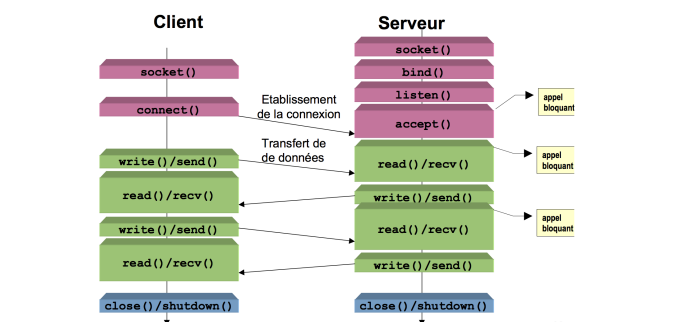

# Network Programming : WEB Sockets

## Compile and Run

> On which platforme show i run this project ?

This project is can only run on **Windows OS** machines, and that's because **Web Sockets** are a down level utilities,  used to establish communication between to nodes.

> Environment setup :

Now before compiling your project you should set up your environment : 

* Install gcc compiler [link here](https://gcc.gnu.org/)

> How to compile and run the project

Inside the project folder there are two files, [server.c](https://github.com/Aniss-nahim/WEBSocket/blob/master/server.c) which basiclly defines the server socket and builds up the server and we have also [client.c](https://github.com/Aniss-nahim/WEBSocket/blob/master/client.c) file which configures the client socket and connect to the server in order to start sending requests.

1. Compile __server.c__ file

```bash
gcc server.c -o server -lws2_32
```

2. Compile __client.c__ file

```bash
gcc client.c -o client -lws2_32
```

3. Run the __server.exe__ program first by executing the following command :

```bash
./server
```

4. will the server is know listening on the socket, we should run the __client.exe__ program :


```bash
./client
```

:clap: :clap: Great job !!

---

## Web Sockets

> Client-Server Lifecycle :




